# Design Document: CouchCode Platform

## Overview

CouchCode is a browser-first cloud couch gaming platform enabling WebAssembly-based retro game emulation with a multi-device session system. Players can run games directly in the browser (no installs), and multiple devices can join a session — one acting as the display, others as wireless controllers — replicating the couch gaming experience over a network.

This design covers the full system: emulation engine, multi-device session architecture, input pipeline, database schema, API design, frontend component hierarchy, security, monetization, and deployment.

---

## Architecture

### System Component Overview

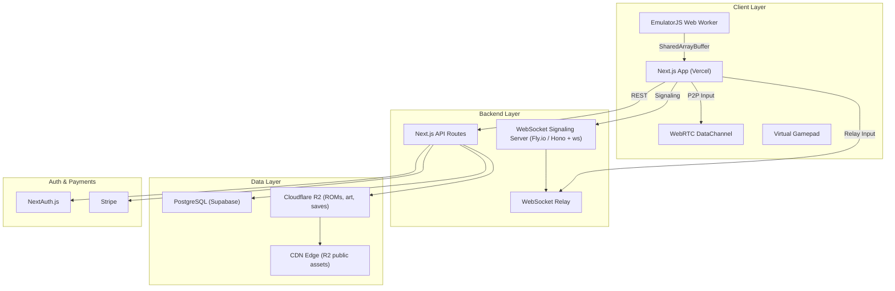

### Multi-Device Session Flow

```mermaid
sequenceDiagram
    participant H as Host Device
    participant S as Signaling Server
    participant C as Controller Device

    H->>S: WS connect + create session
    S-->>H: session_code = "XKQP7"
    C->>S: WS connect + join("XKQP7")
    S-->>C: session info + peer offer
    H->>S: ICE candidates
    C->>S: ICE candidates
    S->>H: forward C's candidates
    S->>C: forward H's candidates
    H<-->C: WebRTC DataChannel established
    C->>H: Input_Event (binary, 7 bytes)
    H->>H: Apply to emulator input loop
    Note over H,C: If WebRTC fails after 10s → relay fallback
    C->>S: Input_Event via WebSocket relay
    S->>H: Forward Input_Event
```

### Deployment Architecture

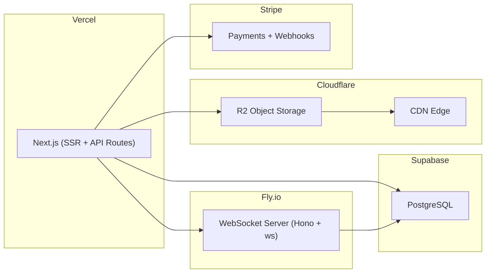

---

## Components and Interfaces

### 1. Emulation Engine

The emulation engine is the most complex subsystem. It runs entirely in the browser using EmulatorJS WebAssembly cores.

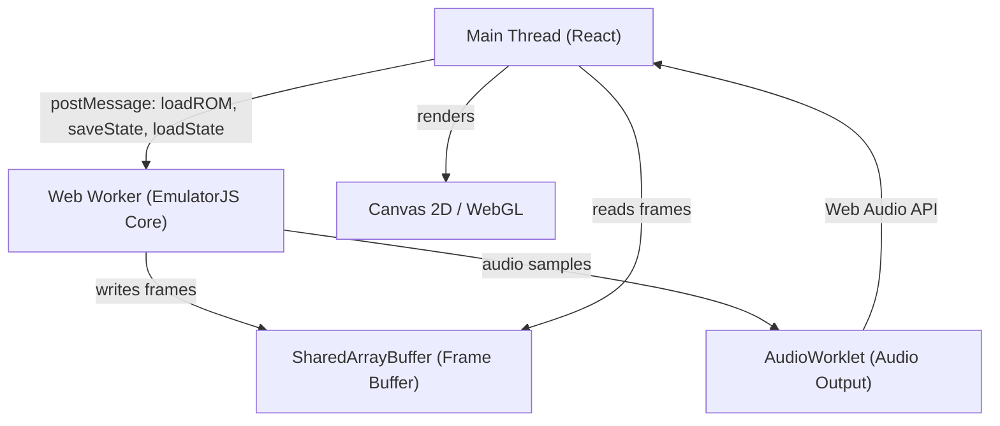

**EmulatorJS Integration:**
- EmulatorJS is loaded as a dynamic client-only import (`next/dynamic` with `ssr: false`)
- The core runs in a dedicated Web Worker via EmulatorJS's built-in worker support
- `SharedArrayBuffer` is used for zero-copy frame buffer sharing (requires `Cross-Origin-Opener-Policy: same-origin` and `Cross-Origin-Embedder-Policy: require-corp` headers)
- Audio is routed through `AudioWorklet` for low-latency synchronized output
- The canvas element is managed by a React ref; fullscreen is triggered via the Fullscreen API

**Save State Serialization:**
- EmulatorJS exposes `saveState()` → returns a binary `Uint8Array` blob
- The blob is uploaded to Cloudflare R2 via a signed PUT URL
- A thumbnail is captured from the canvas via `canvas.toBlob()` and uploaded alongside
- On load, a signed GET URL is fetched and the blob is passed to `loadState(blob)`

**Supported Systems:**

| System | Core | Target FPS |
|--------|------|-----------|
| NES | FCEUmm | 60 |
| SNES | Snes9x | 60 |
| GBA | mGBA | 60 |
| N64 | Mupen64Plus | 60 |
| PSP | PPSSPP | 30 |
| PS2 | PCSX2 | 30 |

### 2. Multi-Device Session System

#### Session State Machine

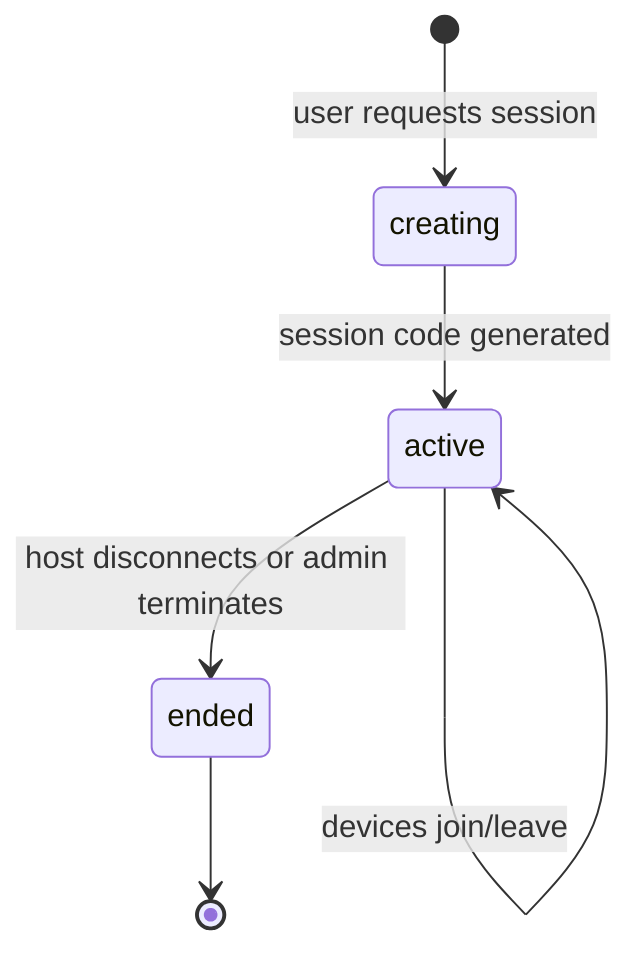

#### Device Role State Machine

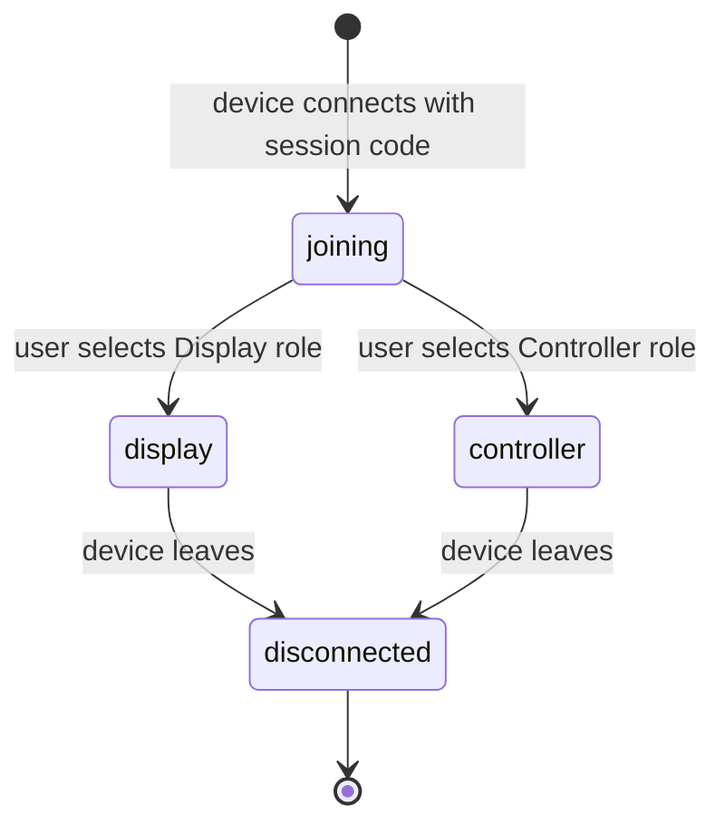

#### Signaling Server (Hono + ws on Fly.io)

The WebSocket signaling server handles:
1. Session creation and code generation
2. WebRTC offer/answer/ICE candidate relay
3. Input event relay fallback
4. Device disconnect notifications

**WebSocket Message Protocol:**

```typescript
type SignalingMessage =
  | { type: "create_session"; gameId: string; hostToken: string }
  | { type: "session_created"; sessionCode: string }
  | { type: "join_session"; sessionCode: string; deviceToken: string }
  | { type: "device_joined"; deviceToken: string; role: "display" | "controller" }
  | { type: "offer"; sdp: RTCSessionDescriptionInit; targetDevice: string }
  | { type: "answer"; sdp: RTCSessionDescriptionInit; targetDevice: string }
  | { type: "ice_candidate"; candidate: RTCIceCandidateInit; targetDevice: string }
  | { type: "relay_input"; payload: ArrayBuffer }  // binary fallback
  | { type: "device_disconnected"; deviceToken: string }
  | { type: "session_terminated" }
```

#### WebRTC P2P Connection

- STUN servers: `stun:stun.l.google.com:19302` (initial), self-hosted TURN planned for Phase 2
- Same-network detection: ICE candidate analysis — if both peers have candidates with the same subnet prefix, P2P is preferred
- DataChannel configuration: `{ ordered: false, maxRetransmits: 0 }` for minimum latency (UDP-like)
- Connection timeout: 10 seconds before relay fallback

### 3. Input Pipeline

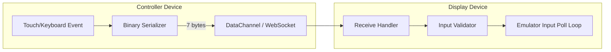

**Binary Input Event Format (7 bytes):**

```
Byte 0:   playerId    (uint8, 1–4)
Byte 1:   buttonId    (uint8, see button map)
Byte 2:   state       (uint8, 0=released, 1=pressed)
Bytes 3–6: timestamp  (uint32 little-endian, ms since epoch mod 2^32)
```

**Button ID Map:**

| ID | Button |
|----|--------|
| 0 | D-Pad Up |
| 1 | D-Pad Down |
| 2 | D-Pad Left |
| 3 | D-Pad Right |
| 4 | A |
| 5 | B |
| 6 | X |
| 7 | Y |
| 8 | L |
| 9 | R |
| 10 | Start |
| 11 | Select |

**Validation allowlist:** Only button IDs 0–11 and player IDs 1–4 are accepted. Any event outside this range is discarded.

### 4. Frontend Architecture

#### Page and Component Hierarchy

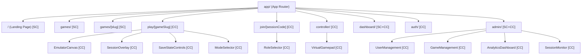

*SC = Server Component, CC = Client Component*

#### Zustand Stores

```typescript
// emulatorStore
interface EmulatorStore {
  status: "idle" | "loading" | "running" | "paused" | "error";
  currentGame: Game | null;
  fps: number;
  loadROM: (url: string, system: System) => void;
  saveState: (slot: number) => Promise<void>;
  loadState: (slot: number) => Promise<void>;
  togglePause: () => void;
}

// sessionStore
interface SessionStore {
  sessionCode: string | null;
  role: "host" | "display" | "controller" | null;
  connectedDevices: Device[];
  connectionType: "webrtc" | "relay" | null;
  latency: number;
  createSession: (gameId: string) => Promise<string>;
  joinSession: (code: string) => Promise<void>;
  sendInput: (event: InputEvent) => void;
}

// userStore
interface UserStore {
  user: User | null;
  tier: "free" | "pro" | "guest";
  isAdmin: boolean;
  setUser: (user: User | null) => void;
}
```

#### React Query Usage

- `useGames(filters)` — paginated game library
- `useGame(slug)` — single game detail
- `useSaveStates(gameId)` — user's save states for a game
- `usePlayHistory()` — user's play history
- `useFavorites()` — user's favorited games
- `useSubscription()` — current subscription status
- `useAdminUsers(filters)` — admin user table
- `useAdminAnalytics()` — analytics dashboard data

---

## Data Models

### Database Schema (Drizzle ORM / PostgreSQL)

```typescript
// users
export const users = pgTable("users", {
  id: uuid("id").primaryKey().defaultRandom(),
  email: varchar("email", { length: 255 }).notNull().unique(),
  username: varchar("username", { length: 50 }).notNull().unique(),
  passwordHash: varchar("password_hash", { length: 255 }),
  avatarUrl: varchar("avatar_url", { length: 500 }),
  role: varchar("role", { length: 20 }).notNull().default("user"), // "user" | "admin"
  subscriptionTier: varchar("subscription_tier", { length: 20 }).notNull().default("free"),
  isBanned: boolean("is_banned").notNull().default(false),
  createdAt: timestamp("created_at").notNull().defaultNow(),
  updatedAt: timestamp("updated_at").notNull().defaultNow(),
});

// guests
export const guests = pgTable("guests", {
  id: uuid("id").primaryKey().defaultRandom(),
  sessionToken: varchar("session_token", { length: 500 }).notNull().unique(),
  createdAt: timestamp("created_at").notNull().defaultNow(),
  expiresAt: timestamp("expires_at").notNull(),
});

// games
export const games = pgTable("games", {
  id: uuid("id").primaryKey().defaultRandom(),
  title: varchar("title", { length: 255 }).notNull(),
  slug: varchar("slug", { length: 255 }).notNull().unique(),
  system: varchar("system", { length: 20 }).notNull(), // "nes"|"snes"|"gba"|"n64"|"psp"|"ps2"
  genre: varchar("genre", { length: 50 }).notNull(),
  tags: text("tags").array(),
  romPath: varchar("rom_path", { length: 500 }).notNull(),
  coverArtPath: varchar("cover_art_path", { length: 500 }),
  description: text("description"),
  releaseYear: integer("release_year"),
  playerCount: integer("player_count").notNull().default(1),
  isActive: boolean("is_active").notNull().default(true),
  isPremium: boolean("is_premium").notNull().default(false),
  price: integer("price"), // cents, null = free
  totalPlays: integer("total_plays").notNull().default(0),
  createdAt: timestamp("created_at").notNull().defaultNow(),
});

// game_sessions
export const gameSessions = pgTable("game_sessions", {
  id: uuid("id").primaryKey().defaultRandom(),
  code: varchar("code", { length: 10 }).notNull().unique(),
  hostUserId: uuid("host_user_id").references(() => users.id),
  gameId: uuid("game_id").notNull().references(() => games.id),
  mode: integer("mode").notNull(), // 1|2|3|4
  status: varchar("status", { length: 20 }).notNull().default("active"), // "active"|"ended"
  createdAt: timestamp("created_at").notNull().defaultNow(),
  endedAt: timestamp("ended_at"),
});

// session_devices
export const sessionDevices = pgTable("session_devices", {
  id: uuid("id").primaryKey().defaultRandom(),
  sessionId: uuid("session_id").notNull().references(() => gameSessions.id),
  deviceToken: varchar("device_token", { length: 255 }).notNull(),
  role: varchar("role", { length: 20 }).notNull(), // "host"|"display"|"controller"
  playerSlot: integer("player_slot"), // 1–4, null for display
  joinedAt: timestamp("joined_at").notNull().defaultNow(),
  disconnectedAt: timestamp("disconnected_at"),
});

// save_states
export const saveStates = pgTable("save_states", {
  id: uuid("id").primaryKey().defaultRandom(),
  userId: uuid("user_id").notNull().references(() => users.id),
  gameId: uuid("game_id").notNull().references(() => games.id),
  slotNumber: integer("slot_number").notNull(),
  stateDataPath: varchar("state_data_path", { length: 500 }).notNull(),
  thumbnailPath: varchar("thumbnail_path", { length: 500 }),
  createdAt: timestamp("created_at").notNull().defaultNow(),
}, (t) => ({
  uniqueSlot: unique().on(t.userId, t.gameId, t.slotNumber),
}));

// play_history
export const playHistory = pgTable("play_history", {
  id: uuid("id").primaryKey().defaultRandom(),
  userId: uuid("user_id").references(() => users.id), // null for guests
  gameId: uuid("game_id").notNull().references(() => games.id),
  sessionId: uuid("session_id").references(() => gameSessions.id),
  playedAt: timestamp("played_at").notNull().defaultNow(),
  durationSeconds: integer("duration_seconds"),
});

// favorites
export const favorites = pgTable("favorites", {
  userId: uuid("user_id").notNull().references(() => users.id),
  gameId: uuid("game_id").notNull().references(() => games.id),
  createdAt: timestamp("created_at").notNull().defaultNow(),
}, (t) => ({
  pk: primaryKey({ columns: [t.userId, t.gameId] }),
}));

// subscriptions
export const subscriptions = pgTable("subscriptions", {
  id: uuid("id").primaryKey().defaultRandom(),
  userId: uuid("user_id").notNull().references(() => users.id),
  plan: varchar("plan", { length: 20 }).notNull().default("pro"),
  status: varchar("status", { length: 20 }).notNull(), // "active"|"past_due"|"canceled"|"trialing"
  startDate: timestamp("start_date").notNull(),
  endDate: timestamp("end_date"),
  stripeSubscriptionId: varchar("stripe_subscription_id", { length: 255 }).notNull().unique(),
  stripeCustomerId: varchar("stripe_customer_id", { length: 255 }).notNull(),
  createdAt: timestamp("created_at").notNull().defaultNow(),
  updatedAt: timestamp("updated_at").notNull().defaultNow(),
});

// game_purchases
export const gamePurchases = pgTable("game_purchases", {
  id: uuid("id").primaryKey().defaultRandom(),
  userId: uuid("user_id").notNull().references(() => users.id),
  gameId: uuid("game_id").notNull().references(() => games.id),
  purchasedAt: timestamp("purchased_at").notNull().defaultNow(),
  stripePaymentIntentId: varchar("stripe_payment_intent_id", { length: 255 }).notNull(),
  amountCents: integer("amount_cents").notNull(),
}, (t) => ({
  uniquePurchase: unique().on(t.userId, t.gameId),
}));

// ad_impressions
export const adImpressions = pgTable("ad_impressions", {
  id: uuid("id").primaryKey().defaultRandom(),
  userId: uuid("user_id").references(() => users.id),
  gameId: uuid("game_id").references(() => games.id),
  adUnit: varchar("ad_unit", { length: 100 }).notNull(),
  timestamp: timestamp("timestamp").notNull().defaultNow(),
});
```

### Entity Relationship Diagram

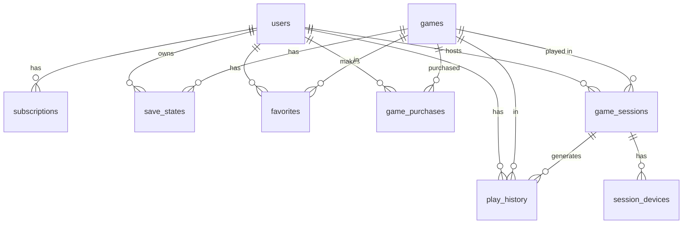

---

## API Endpoint Specifications

### REST API (Next.js API Routes)

#### Authentication

| Method | Path | Description | Auth |
|--------|------|-------------|------|
| POST | `/api/auth/register` | Email/password registration | None |
| POST | `/api/auth/login` | Email/password login | None |
| POST | `/api/auth/guest` | Issue guest JWT | None |
| POST | `/api/auth/logout` | Clear session cookie | Any |
| GET | `/api/auth/me` | Current user info | Any |
| POST | `/api/auth/reset-password` | Request password reset | None |
| PUT | `/api/auth/reset-password` | Confirm password reset | None |

#### Games

| Method | Path | Description | Auth |
|--------|------|-------------|------|
| GET | `/api/games` | List games (paginated, filterable) | Any |
| GET | `/api/games/[slug]` | Game detail | Any |
| GET | `/api/games/[slug]/rom-url` | Get signed ROM URL | Any |
| POST | `/api/admin/games` | Upload game | Admin |
| PUT | `/api/admin/games/[id]` | Update game metadata | Admin |
| PATCH | `/api/admin/games/[id]/status` | Toggle active status | Admin |

#### Sessions

| Method | Path | Description | Auth |
|--------|------|-------------|------|
| POST | `/api/sessions` | Create session | Any |
| GET | `/api/sessions/[code]` | Get session info | Any |
| DELETE | `/api/sessions/[code]` | End session | Host/Admin |
| POST | `/api/sessions/[code]/join` | Join session | Any |

#### Save States

| Method | Path | Description | Auth |
|--------|------|-------------|------|
| GET | `/api/save-states/[gameId]` | List user's save states | User |
| POST | `/api/save-states` | Create save state (get upload URL) | User |
| DELETE | `/api/save-states/[id]` | Delete save state | User |

#### User / Dashboard

| Method | Path | Description | Auth |
|--------|------|-------------|------|
| GET | `/api/user/play-history` | Play history | User |
| GET | `/api/user/favorites` | Favorites list | User |
| POST | `/api/user/favorites/[gameId]` | Add favorite | User |
| DELETE | `/api/user/favorites/[gameId]` | Remove favorite | User |

#### Subscriptions & Payments

| Method | Path | Description | Auth |
|--------|------|-------------|------|
| POST | `/api/subscriptions/checkout` | Create Stripe Checkout session | User |
| POST | `/api/subscriptions/portal` | Stripe customer portal | User |
| POST | `/api/webhooks/stripe` | Stripe webhook handler | Stripe sig |
| POST | `/api/purchases/[gameId]` | Create Payment Intent | User |

#### Admin

| Method | Path | Description | Auth |
|--------|------|-------------|------|
| GET | `/api/admin/users` | List users | Admin |
| PATCH | `/api/admin/users/[id]` | Update user (ban/role) | Admin |
| GET | `/api/admin/analytics` | Analytics data | Admin |
| GET | `/api/admin/sessions` | Active sessions | Admin |
| DELETE | `/api/admin/sessions/[code]` | Terminate session | Admin |

### WebSocket Server API (Fly.io)

**Connection:** `wss://ws.couchcode.app`

All messages are JSON-encoded except relay input events which are raw binary `ArrayBuffer`.

**Client → Server:**

```typescript
// Connect and authenticate
{ type: "auth", token: string }

// Create a session
{ type: "create_session", gameId: string }

// Join a session
{ type: "join_session", code: string, role: "display" | "controller" }

// WebRTC signaling
{ type: "offer", sdp: RTCSessionDescriptionInit, to: string }
{ type: "answer", sdp: RTCSessionDescriptionInit, to: string }
{ type: "ice_candidate", candidate: RTCIceCandidateInit, to: string }

// Relay input (binary ArrayBuffer, 7 bytes)
// Sent as raw binary frame
```

**Server → Client:**

```typescript
{ type: "session_created", code: string }
{ type: "device_joined", deviceToken: string, role: string, playerSlot: number | null }
{ type: "offer", sdp: RTCSessionDescriptionInit, from: string }
{ type: "answer", sdp: RTCSessionDescriptionInit, from: string }
{ type: "ice_candidate", candidate: RTCIceCandidateInit, from: string }
{ type: "device_disconnected", deviceToken: string }
{ type: "session_terminated" }
{ type: "error", code: string, message: string }
// Relay input: raw binary frame forwarded to target device
```

---

## Security Design

### Authentication Flow

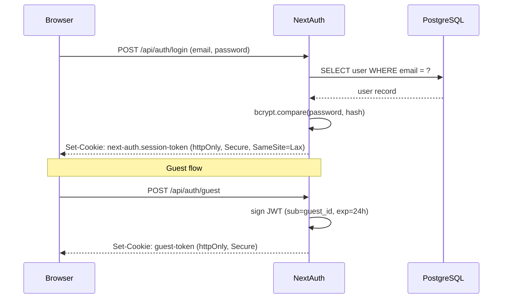

### Security Controls Summary

| Control | Implementation |
|---------|---------------|
| ROM access | Signed R2 URLs, 1-hour expiry, generated server-side |
| Session tokens | httpOnly cookies, 7-day expiry, NextAuth managed |
| Guest tokens | JWT in httpOnly cookie, 24-hour expiry |
| Admin routes | Server-side role middleware on all `/api/admin/*` and `/admin/*` |
| Rate limiting | Upstash Redis-based rate limiter on session creation (5/hr/IP) |
| Input validation | Button ID allowlist (0–11), player ID allowlist (1–4) |
| CORS | `Access-Control-Allow-Origin: https://couchcode.app` only |
| CSP | `default-src 'self'; script-src 'self' 'wasm-unsafe-eval'` (WASM requires `wasm-unsafe-eval`) |
| HTTPS | Enforced at Vercel and Fly.io edge |
| Password hashing | bcrypt, 12 salt rounds |

### ROM Signed URL Flow

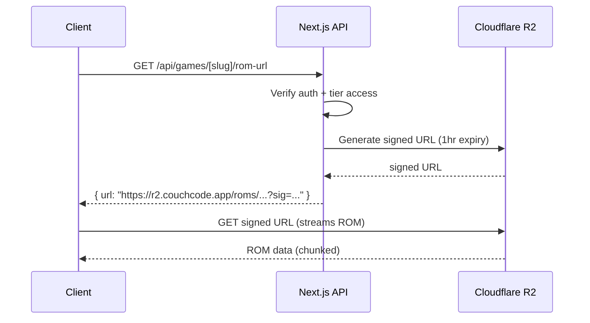

---

## Error Handling

### API Error Response Format

```typescript
interface ApiError {
  error: {
    code: string;       // machine-readable, e.g. "SESSION_NOT_FOUND"
    message: string;    // human-readable
    retryAfter?: number; // seconds, present on 429
  };
}
```

### Error Codes

| Code | HTTP Status | Description |
|------|-------------|-------------|
| `SESSION_NOT_FOUND` | 404 | Session code does not exist or is expired |
| `SESSION_FULL` | 409 | Session already has 5 devices |
| `RATE_LIMITED` | 429 | Too many session creation requests |
| `UNAUTHORIZED` | 401 | Missing or invalid auth token |
| `FORBIDDEN` | 403 | Insufficient tier or role |
| `GAME_NOT_FOUND` | 404 | Game slug not found |
| `INVALID_INPUT` | 400 | Malformed request body |
| `PAYMENT_FAILED` | 402 | Stripe payment error |
| `SAVE_LIMIT_REACHED` | 409 | Free tier save state limit hit |

### Emulator Error Handling

- ROM load failure → display error overlay with retry button
- WebAssembly crash → catch in worker `onerror`, post message to main thread, show error UI
- Audio context suspended (browser policy) → prompt user to interact, then resume

### WebRTC / WebSocket Error Handling

- ICE failure after 10s → automatic relay fallback, no user action required
- WebSocket disconnect → exponential backoff reconnect (1s, 2s, 4s, max 30s)
- Relay message loss → no retransmit (input events are time-sensitive; stale inputs are dropped)

---

## Testing Strategy

### Unit Tests (Vitest)

Focus on pure functions and business logic:
- Input event serialization/deserialization
- Session code generation uniqueness
- Subscription tier access gating logic
- Button ID validation allowlist
- Save state slot limit enforcement
- JWT generation and validation

### Integration Tests

- API route handlers with mocked database
- Stripe webhook handler with test events
- WebSocket signaling message routing
- ROM signed URL generation

### Property-Based Tests (fast-check)

See Correctness Properties section below. Each property test runs minimum 100 iterations.

Tag format: `// Feature: couchcode-platform, Property N: <property text>`

### End-to-End Tests (Playwright)

- Mode 1 gameplay flow: load game → play → save state → reload
- Auth flow: register → login → access dashboard
- Session flow: create session → join on second device → controller input received
- Subscription flow: checkout → webhook → tier upgrade

### Performance Tests

- Emulator FPS measurement under load
- WebRTC latency measurement (same-network)
- Core Web Vitals via Lighthouse CI


---

## Correctness Properties

*A property is a characteristic or behavior that should hold true across all valid executions of a system — essentially, a formal statement about what the system should do. Properties serve as the bridge between human-readable specifications and machine-verifiable correctness guarantees.*

**Property-based testing library:** [fast-check](https://fast-check.dev/) (TypeScript/JavaScript). Each property test runs a minimum of 100 iterations.

**Property reflection:** After analyzing all acceptance criteria, the following redundancies were eliminated:
- Requirements 3.1 and 3.4 both concern session code uniqueness → merged into Property 2
- Requirements 3.7 and 27.2 both concern rate limiting → merged into Property 7
- Requirements 17.4 and 18.1–18.8 all concern tier-based access gating → merged into Property 6

---

### Property 1: Save State Round Trip

*For any* valid emulator game state, serializing it to a binary blob and then deserializing that blob SHALL produce a state that is byte-for-byte equivalent to the original serialized form.

**Validates: Requirements 1.10, 2.1, 2.3**

---

### Property 2: Session Code Format and Uniqueness

*For any* batch of N generated session codes, every code SHALL be exactly 5 characters long, match the pattern `[A-Z0-9]{5}`, and no two codes in the batch SHALL be identical.

**Validates: Requirements 3.1, 3.4**

---

### Property 3: Session Device Count Invariant

*For any* sequence of device join attempts on a session, the number of connected devices SHALL never exceed 5, and any join attempt when 5 devices are already connected SHALL be rejected with an error.

**Validates: Requirements 4.6, 4.7**

---

### Property 4: Input Event Serialization Round Trip

*For any* valid input event (playerId ∈ {1,2,3,4}, buttonId ∈ {0..11}, state ∈ {0,1}, timestamp ∈ uint32), serializing to the 7-byte binary format and then deserializing SHALL produce an object with all fields equal to the original.

**Validates: Requirements 7.1, 7.4**

---

### Property 5: Input Event Validation Allowlist

*For any* 7-byte binary sequence, the validator SHALL accept it if and only if byte 0 (playerId) ∈ {1,2,3,4}, byte 1 (buttonId) ∈ {0..11}, and byte 2 (state) ∈ {0,1}. All other sequences SHALL be rejected.

**Validates: Requirements 7.6, 7.7, 27.7**

---

### Property 6: Tier-Based Feature Access Gating

*For any* user object, the feature access function SHALL return exactly the free-tier feature set (ads shown, save limit = 1, mode 1 only) when the user's subscription status is not "active", and exactly the pro-tier feature set (no ads, unlimited saves, all modes) when the subscription status is "active".

**Validates: Requirements 17.4, 18.1, 18.2, 18.3, 18.4, 18.5, 18.6, 18.7, 18.8**

---

### Property 7: Rate Limit Invariant

*For any* IP address, after exactly 5 session creation requests within a 1-hour window, every subsequent request within that same window SHALL be rejected with HTTP 429 and a `retry-after` header.

**Validates: Requirements 3.7, 27.2, 27.3**

---

### Property 8: Virtual Gamepad Press Registration

*For any* sequence of button press events delivered to the virtual gamepad handler, every press event SHALL produce exactly one corresponding Input_Event with state = pressed, and every release event SHALL produce exactly one Input_Event with state = released, with no events dropped.

**Validates: Requirements 8.3, 8.4, 8.8**

---

### Property 9: Signed URL Expiry

*For any* valid ROM path, the generated signed URL SHALL have an expiry timestamp in the range [now + 3599s, now + 3601s], ensuring the 1-hour expiry window is correctly applied.

**Validates: Requirements 14.2, 27.1**

---

### Property 10: Guest Token Expiry

*For any* guest token generated at time T, the JWT `exp` claim SHALL equal T + 86400 (24 hours in seconds).

**Validates: Requirements 16.3, 27.4**

---

### Property 11: Game Search Relevance

*For any* non-empty search query string and any game library, every game returned by the search function SHALL have a title that contains the query string (case-insensitive), and no game whose title does not contain the query SHALL appear in the results.

**Validates: Requirements 13.2**

---

### Property 12: Game List Sort Correctness

*For any* game list and any valid sort key (title, releaseYear, totalPlays), the sorted output SHALL satisfy the ordering invariant: for all adjacent pairs (a, b) in the result, `sortKey(a) <= sortKey(b)`.

**Validates: Requirements 13.8**

---

### Property 13: Favorites Count Invariant

*For any* user, the favorites count SHALL never exceed 50. Any attempt to add a 51st favorite SHALL be rejected with an error, and the favorites list SHALL remain unchanged.

**Validates: Requirements 29.6**

---

## Deployment Architecture

### Infrastructure Overview

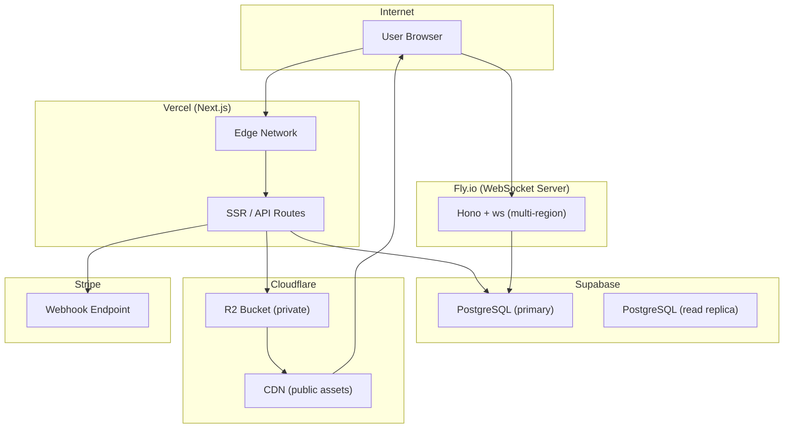

### Environment Configuration

| Variable | Description |
|----------|-------------|
| `DATABASE_URL` | Supabase PostgreSQL connection string |
| `NEXTAUTH_SECRET` | NextAuth signing secret |
| `NEXTAUTH_URL` | Production URL |
| `GOOGLE_CLIENT_ID` | Google OAuth client ID |
| `GOOGLE_CLIENT_SECRET` | Google OAuth client secret |
| `R2_ACCOUNT_ID` | Cloudflare account ID |
| `R2_ACCESS_KEY_ID` | R2 access key |
| `R2_SECRET_ACCESS_KEY` | R2 secret key |
| `R2_BUCKET_NAME` | R2 bucket name |
| `STRIPE_SECRET_KEY` | Stripe secret key |
| `STRIPE_WEBHOOK_SECRET` | Stripe webhook signing secret |
| `STRIPE_PRO_PRICE_ID` | Stripe price ID for Pro subscription |
| `WS_SERVER_URL` | WebSocket server URL (Fly.io) |
| `WS_SERVER_SECRET` | Shared secret for WS server auth |
| `UPSTASH_REDIS_URL` | Redis URL for rate limiting |
| `UPSTASH_REDIS_TOKEN` | Redis token |

### Scaling Considerations

- **Next.js on Vercel**: Serverless functions auto-scale; no configuration needed
- **WebSocket server on Fly.io**: Deployed in 2+ regions (us-east, eu-west); sticky sessions via Fly.io's anycast routing
- **PostgreSQL on Supabase**: Connection pooling via PgBouncer (built-in); read replicas for analytics queries
- **R2**: Globally distributed; no scaling needed
- **Rate limiting**: Upstash Redis (serverless Redis) for distributed rate limit state across Vercel edge functions

### PWA Configuration

**`public/manifest.json`:**
```json
{
  "name": "CouchCode",
  "short_name": "CouchCode",
  "description": "Browser-first retro gaming platform",
  "start_url": "/",
  "display": "standalone",
  "background_color": "#0f0f0f",
  "theme_color": "#7c3aed",
  "icons": [
    { "src": "/icons/icon-192.png", "sizes": "192x192", "type": "image/png" },
    { "src": "/icons/icon-512.png", "sizes": "512x512", "type": "image/png" },
    { "src": "/icons/icon-512-maskable.png", "sizes": "512x512", "type": "image/png", "purpose": "maskable" }
  ]
}
```

**Service Worker caching strategy:**
- Shell assets (HTML, CSS, JS, fonts, icons): Cache-first with network fallback
- API responses: Network-first with stale-while-revalidate
- ROM files: **Explicitly excluded** — always fetched from network via signed URL
- Game cover art: Cache-first (immutable once uploaded)

### Monetization Architecture

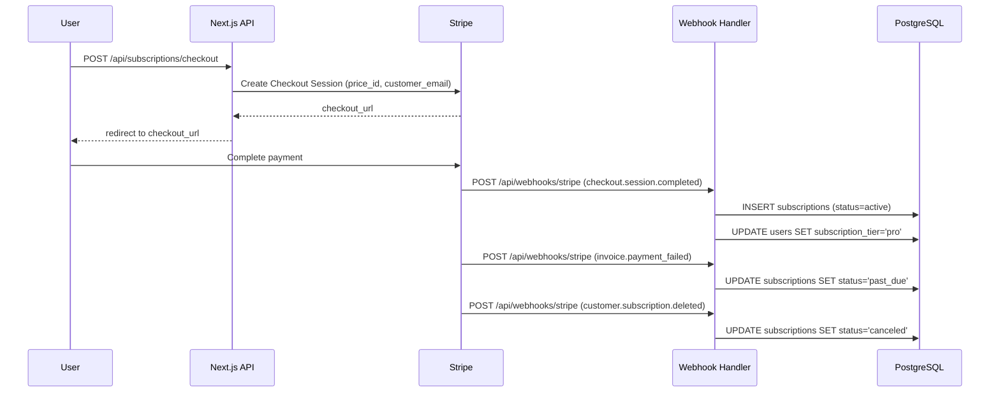

**Stripe Products:**
- Pro Subscription: `$9.99/month` recurring
- Game purchases: one-time Payment Intents, price set per game ($2.99–$9.99)

**Feature gating middleware** (`lib/featureGate.ts`):
```typescript
export function getFeatureAccess(user: User | Guest): FeatureAccess {
  const isActive = user.subscriptionTier === "pro" &&
    user.subscription?.status === "active";
  return {
    showAds: !isActive,
    saveStateLimit: isActive ? Infinity : 1,
    allowedModes: isActive ? [1, 2, 3, 4] : [1],
    fullLibrary: isActive,
  };
}
```

---

## Data Flow Diagrams

### Mode 1 — Single Device Single Player

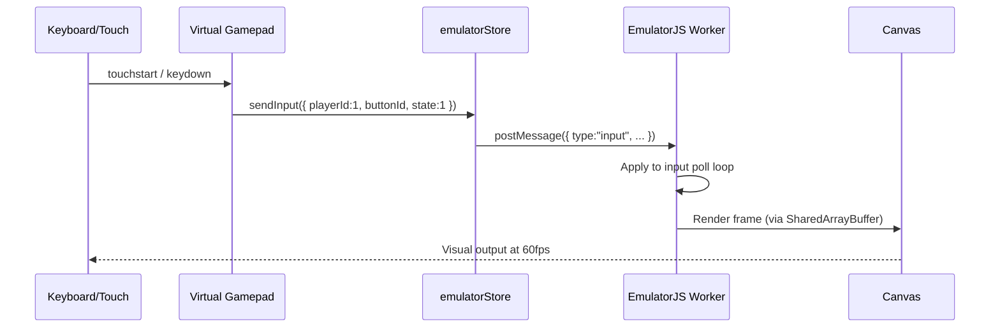

### Mode 3 — Display + Controller

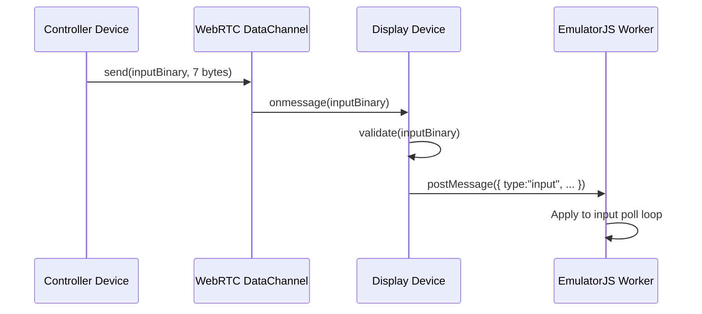

### Save State Flow

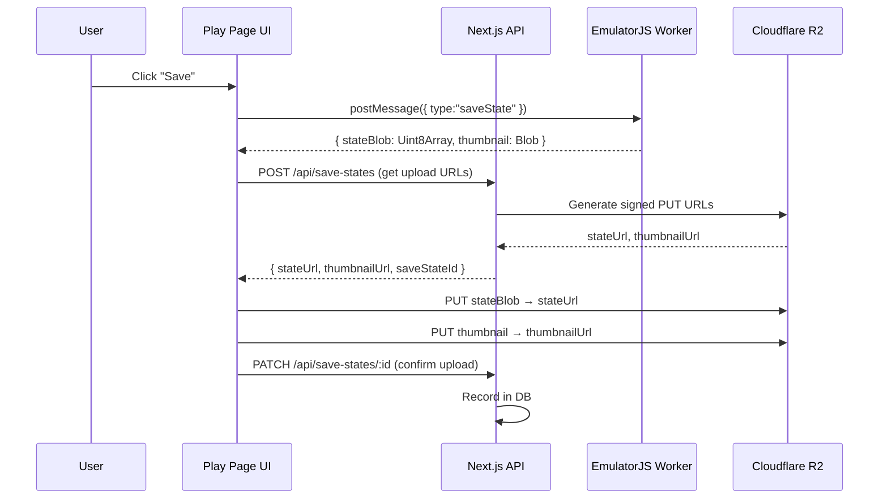

